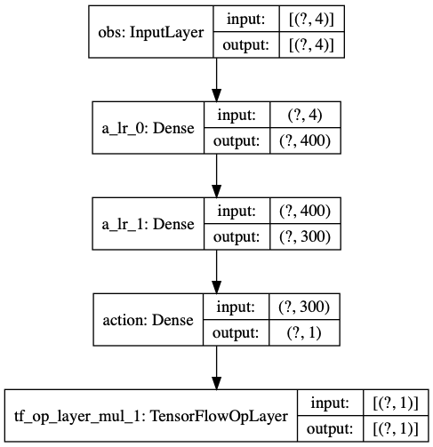
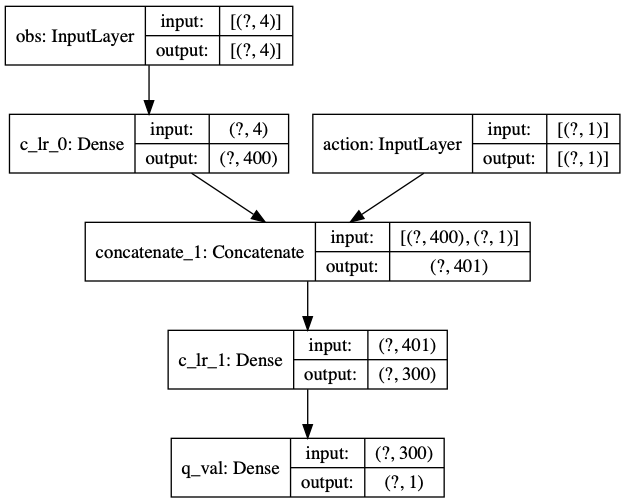
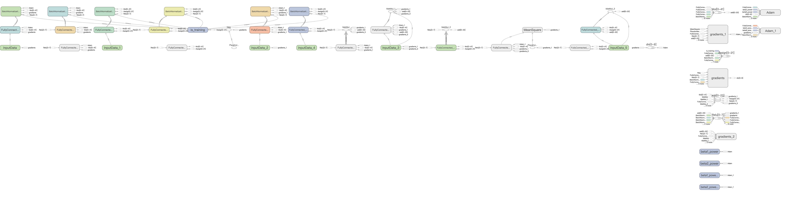

# DDPG_Tensorflow
DDPG, Tensorflow1, Tensorflow2

使用DDPG跑pendulam倒立摆

Tensorflow2网络模型：

Actor:

Critic:

TensorFlow1

actor 添加批量正则化，实验表明，更具有数值稳定性

Critic 多添加两个Dense层，把state调整到300，action调整到300，然后对应元素相加，而不是tensorflow2版本的concate.

*Reference*

[Actor Critic](https://www.bilibili.com/video/av86150200)

[RL DDPG](https://www.bilibili.com/video/av86370918)

[DDPG Code Review](https://www.bilibili.com/video/av86556235)

[DDPG update network](https://www.bilibili.com/video/av86663670)

